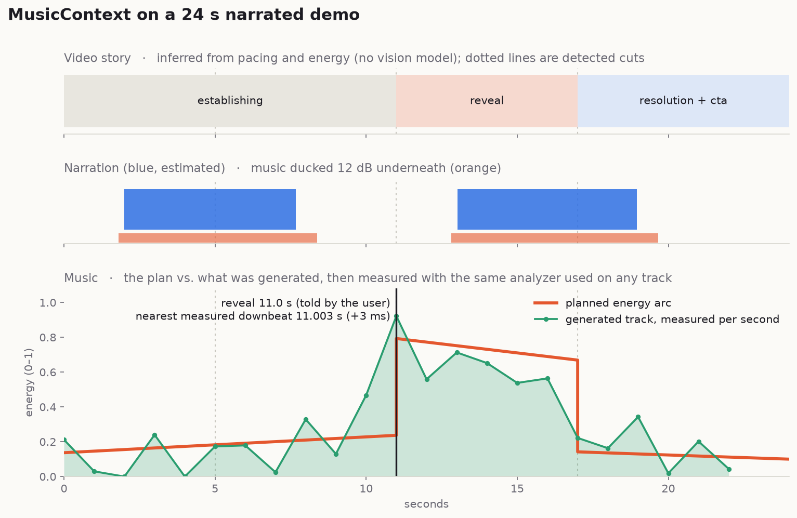

# MusicContext

**Music intelligence for AI agents.**

[](https://github.com/AAGAM17/MusicContext/actions/workflows/ci.yml)
[](LICENSE)


AI agents can generate remarkable video. They still make poor music decisions — a generic loop at the wrong tempo,
mood-matched by vibe alone, indifferent to the cut rhythm, deaf to the voiceover, peaking nowhere near the reveal,
and ending mid-phrase.

MusicContext gives an agent a music director:

```
video → story → music direction → soundtrack → sync → final video
```

It is a local-first CLI, MCP server, Python SDK and Agent Skill. It analyses what a video *is*, decides what music
it *needs*, finds or generates that music, and mixes it in — and it tells you which of those conclusions it
measured and which it guessed.

> **Status: 0.1.0, pre-1.0.** Everything documented below is implemented and tested, with two exceptions that are
> called out explicitly: Codex support is **unverified** (see [Codex](#codex)), and the Docker image has **never been
> built** (see [`docs/deployment`](docs/deployment/README.md)). The honest limits of each estimator are listed in
> [What MusicContext knows vs. guesses](#what-musiccontext-knows-vs-guesses).

---

## Why this exists

Ask an agent for "cinematic music" and it picks a cinematic-sounding file. That is a *tagging* decision. The musical
decisions that make an edit work are temporal:

- At **18.2 s** the product appears. The music should land its biggest hit there, not 900 ms later.
- The narrator speaks for **48 %** of the timeline. A dense arrangement with a lead melody will fight every word.
- Cuts recur every **2.0 s**. At 120 BPM, every cut falls on a beat; at 103 BPM, none do.
- The video ends at **24.0 s**. The music has to *resolve* there, not get cut off.

MusicContext turns those into a structured, inspectable plan — and keeps the provenance of every number.

## How it works

```
                        AI CODING AGENT  (Claude Code, Codex, …)
                                  │
                         MusicContext Skill
                                  │
                      CLI  ·  MCP  ·  Python SDK
                                  │
                      ┌─── operation layer ───┐
                      │                       │
              Video Analyzer            Music Direction Engine
       scenes · motion · colour      style · mood · tempo · arc
       speech · silence · energy     instrumentation · ducking
                      │                       │
                 Story Model ─────────────────┘
                                  │
                       Music Direction Plan   ──→  .musicctx artifact
                                  │
             ┌────────────────────┼────────────────────┐
        Local Library        Search Providers     Generation
                             └────────┬───────────────┘
                              Explainable Selection
                                  │
                        Alignment  ·  Ducking  ·  Looping
                                  │
                            FFmpeg render
                                  │
                             Final video
```

The core engine knows nothing about any specific model, vendor or catalogue. Providers plug in behind interfaces.

## Install

Requires **Python 3.11+** and **FFmpeg 6+** (`ffmpeg` and `ffprobe` on `PATH`).

```bash
pipx install "musiccontext[agent] @ git+https://github.com/AAGAM17/MusicContext"
musiccontext doctor
```

From a checkout:

```bash
git clone https://github.com/AAGAM17/MusicContext && cd MusicContext
make install && make fixtures && make test
```

## Quickstart

```bash
musiccontext doctor                  # check FFmpeg, storage, providers, agent integrations
musiccontext analyze demo.mp4        # scenes, speech, energy curve, story
musiccontext plan demo.mp4           # the music direction (writes a .musicctx artifact)
musiccontext recommend demo.mp4      # scored candidates, explained
musiccontext sync --video demo.mp4 --music track.mp3 --output final.mp4
```

Add what you know. Inference is a heuristic; a told fact is not:

```bash
musiccontext plan demo.mp4 \
  --marker 18.2=reveal \
  --platform product-demo \
  --style cinematic --mood premium \
  --vocals none --commercial-use
```

No music of your own yet? Both of these work offline, with no credentials:

```bash
musiccontext library scan ~/Music      # index your own files
musiccontext generate demo.mp4         # synthesize a track that follows the plan
```

## What the output looks like

`musiccontext plan demo.mp4 --marker 11.0=reveal --platform product-demo --vocals none` on a 24 s synthesized demo
with narration (real output, trimmed):

```
Music direction  (confidence 0.60)
  minimal · confident, premium, curious · instrumental
  tempo            91 BPM (80-102)
  energy           █████▁             0.28
  rhythm           sparse · texture dry/spacious
  instruments      piano, soft_pads, subtle_percussion
  avoid            vocals, lead_vocal, busy_lead_melody, distorted_guitar

Arc
     0.0-11.0   build                  █▆           0.14  rising layers and rhythmic density leading to the payoff
    11.0-17.0   peak                   █████████    0.74  full arrangement; the main hit lands exactly on the payoff
    17.0-24.0   resolution             █▆           0.14  ease off into a clear resolution / call to action
  peak             11.0s · ending: resolve
  ducking          -12 dB under speech (bed -3 dB)

Key moments
      2.0s  voiceover_start   duck             [estimated] Speech begins; music should make space
     11.0s  reveal            peak             [user]      Supplied by the user/agent: reveal at 11.00s
     17.0s  cta               resolve          [inferred]  Closing section after the peak; possible call to action
     17.0s  hard_cut          none             [detected]  Hard cut (scene score 0.86)
     24.0s  ending            resolve          [detected]  End of video

Why
  - visual pacing is moderate (median scene 6.0s, 7.5 cuts/min)
  - voiceover covers 48% of the video (favours minimal)
  - voiceover covers 48%: tempo capped near 108 BPM so rhythm does not fight speech
  - platform preset range 90-125 BPM applied
  confidence: heuristic analysis only (no vision model): scene roles and the reveal are inferences;
  user markers anchor key moments; speech timing is a heuristic estimate
```

Note the tags: `[user]` was told to us, `[detected]` was measured, `[estimated]` and `[inferred]` were not. That
distinction survives into the JSON, so an agent can report it to the user instead of flattening everything into
false confidence.

With `--json`, every command emits a bounded, machine-readable document.

### Plan, then proof

Then `musiccontext generate` and `musiccontext sync` on the same video. The generated track is measured with the same
analyzer used on any other track, so the picture below compares the *plan* to what actually came out, not to what was
requested:



The requested tempo was 91.1 BPM and the analyzer measured 90.8. The reveal was requested at 11.000 s and the
nearest measured downbeat is at 11.003 s. The generator is a synthesizer: it follows tempo, key, energy and peak
time faithfully, but it is not a composer. Use it as a reference bed, or hand the plan's brief to a human or a
generation service.

## What MusicContext knows vs. guesses

This is the part most tools leave out. Every temporal value carries `source`, `confidence` and `provenance`.

| Value | Basis | Honest limits |
|---|---|---|
| Duration, resolution, fps, streams | `detected` | from the container |
| Cuts / scene boundaries | `detected` | FFmpeg scene scores; soft dissolves are approximate |
| Motion, brightness, colour | `estimated` | 64×36 frame differencing, cut spikes removed |
| Speech intervals | `detected` with a transcript or subtitles, else `estimated` | the heuristic VAD caps confidence at 0.6 and will mislabel some material — pass `--transcript` |
| Scene *roles*, reveal, CTA | `inferred` | pacing and energy only. **No vision model, no OCR.** Use `--marker` for moments that matter |
| Tempo, beats, downbeats, key | `estimated` | classical DSP; half/double-time ambiguity is reported, not hidden; downbeats assume 4/4 |
| Loudness (LUFS) | `detected` | EBU R128 via FFmpeg |
| Vocals present | only from tags, a sidecar or a provider | never guessed from audio |
| License status | `verified` only from a `.license.json` sidecar or a provider API | a copyright string in a file tag is recorded as an *unverified claim* |
| Sync offsets | reported in ms, with the basis | an offset is only as good as the beat estimate behind it |

MusicContext will say "unknown" with a reason rather than invent a number.

## Claude Code

```bash
musiccontext init-agent --mcp      # installs the Skill, adds the MCP server to ./.mcp.json
```

Then, in a session:

```
/musiccontext
Analyze demo.mp4 and tell me what soundtrack it needs.
```

Natural language works too — "use MusicContext to choose music for demo.mp4", "make this video feel cinematic",
"find music that works under the narration", "make the music peak at the product reveal".

`init-agent` never overwrites anything without `--force`, supports `--dry-run`, and prints exactly what it changed.

## Codex

The same Skill, CLI, MCP server, engine, schemas and providers are used — only packaging differs. A
`.codex-plugin/plugin.json` manifest is included and `musiccontext init-agent --codex` installs the Skill.

**This is unverified.** The Codex CLI available during development (`codex-cli 0.46.0`) exposes MCP management but
no skills command, so the Skill-discovery path could not be tested. The MCP path is the supported route:

```bash
codex mcp add musiccontext -- musiccontext mcp
```

Status and what was actually tried: [`docs/agents/codex.md`](docs/agents/codex.md). We will not claim Codex support
until it is verified against a current CLI.

## MCP

```bash
musiccontext mcp                   # JSON-RPC 2.0 over stdio
```

Ten tools: `musiccontext_inspect`, `_analyze`, `_plan`, `_recommend`, `_search`, `_library_search`, `_generate`,
`_sync`, `_providers`, `_get_artifact`.

The MCP surface is deliberately stricter than the CLI: strict input schemas, a **filesystem sandbox** (the working
directory by default, extended with `MUSICCONTEXT_ROOTS`), size-bounded output, sanitized media text, and no work
performed unless a tool call asks for it. See [`docs/agents/mcp.md`](docs/agents/mcp.md).

## CLI

| Command | What it does |
|---|---|
| `inspect` | container metadata only; no analysis |
| `analyze` | scenes, cuts, motion, speech, energy curve, story model |
| `plan` | the Music Direction Plan; writes a `.musicctx` artifact |
| `recommend` | scores real candidates across nine dimensions, with reasons |
| `search` | queries providers and your library |
| `generate` | synthesizes a track that follows the plan |
| `sync` | renders the final video: trim, loop, fade, duck, align |
| `render` | plan + pick/generate + sync in one step |
| `export` | prints a stored artifact (summary or `--full`) |
| `library` | `add`, `scan`, `search`, `list`, `remove`, `stats` |
| `providers` | what is available, what each needs, what leaves your machine |
| `config` | `show` (secrets redacted), `set`, `path` |
| `profile` | brand/creative profiles that bias direction |
| `doctor` | diagnose the install |
| `init-agent` | install the Skill into Claude Code / Codex |
| `mcp` | run the MCP server |

Global flags: `--json --format --quiet --verbose --output --force --no-cache --provider --model --local-only`.

Nothing is overwritten without `--force`; no command ever writes over its own input.

## Local music library

```bash
musiccontext library scan ~/Music
musiccontext library search "cinematic technology" --bpm 110
musiccontext library stats
```

A SQLite index of *your* files. For each track MusicContext measures duration, tempo (with half/double-time
alternatives), beats and downbeats, key, EBU R128 loudness, spectral band ratios and energy lifts, and reads
license metadata. Content-hash dedup; re-analysis only when a file actually changes. Nothing leaves the machine.

## Providers

```bash
musiccontext providers
```

Three kinds — **library**, **search**, **generation** — behind interfaces in
`src/musiccontext/providers/base.py`. Each reports its capabilities explicitly: availability, which environment
variable it needs, and whether it would send media off your machine.

**Shipping today:** the local library, and `procedural` (offline generation). Remote search and generation ship as
documented *templates* (`RemoteSearchProvider`, `HTTPGenerationProvider`) — no vendor endpoints are invented here.
Third parties register providers through the `musiccontext.providers` entry point without touching the engine:
[`docs/providers/writing-a-provider.md`](docs/providers/writing-a-provider.md).

Credentials come from `MUSICCONTEXT_<PROVIDER>_API_KEY`, environment only, never written to config, never logged,
never printed.

## Generation

```bash
musiccontext generate demo.mp4 --seed 7
```

The built-in `procedural` provider runs entirely on your machine and is deterministic from its seed. It follows the
plan's tempo, key, energy curve, section structure and peak times — and the result is then *measured* with the same
analyzer used on any other track, so the reported tempo is observed, not assumed.

## Synchronization

```bash
musiccontext sync --video demo.mp4 --music track.mp3 --output final.mp4
```

Trimming and seeking · looping on musical boundaries with crossfades · fades · gain and optional loudness
normalisation · **speech ducking** derived from the known speech intervals (deterministic, not level-triggered) ·
beat / downbeat / phrase alignment with the achieved offsets reported in milliseconds · subtitle passthrough ·
stream-copied video by default.

The render is written to a temporary file and atomically moved into place, then **re-probed** — the reported output
duration is measured from the finished file, and a mismatch becomes a warning rather than silence.

## Licensing

Licensing is a first-class field, not an afterthought. A license is `verified` only when a trusted source says so:
a `.license.json` sidecar you wrote, or a provider API that returns license fields.

```json
{ "license": "CC-BY-4.0", "commercial_use": true, "attribution_required": true,
  "attribution_text": "Track by Artist (CC BY 4.0)", "source_url": "https://…" }
```

MusicContext will never tell you a track is cleared for commercial use on the strength of a filename or an ID3
comment. Require it explicitly with `--commercial-use`, and uncleared candidates are *excluded with a reason*.

## Security and privacy

- **Local-first. No telemetry, ever.** Nothing leaves your machine unless you choose a provider that requires it,
  and those are flagged. `--local-only` disables them.
- **Media is untrusted data.** Container tags, OCR, subtitles, transcripts and provider responses are sanitized,
  length-bounded, and never executed or forwarded as instructions. Text that looks like an injection attempt is
  surfaced as a warning. Subtitle *text* is discarded entirely — only timings and word counts are kept.
- **No shell.** FFmpeg is always invoked with argument lists.
- **Sandboxed paths** for MCP/REST; traversal, NUL bytes and escaping symlinks are rejected.
- **Remote URLs are off by default.** When enabled: HTTPS only, DNS pinned to the validated IP (closing the
  rebinding window), non-public addresses refused, redirects re-validated per hop, content-type allowlist, size cap
  and timeout.
- **Secrets are redacted** from logs, errors, rendered commands and tool output.

The security suite is written so that *removing a defence makes a test fail*: `make test-security`.
Details in [`SECURITY.md`](SECURITY.md).

## Python SDK

```python
from musiccontext import MusicContext

ctx = MusicContext()
analysis = ctx.analyze("demo.mp4")
plan = ctx.create_music_plan(analysis)
print(plan.music_direction.brief)

recs = ctx.recommend("demo.mp4")
for a in recs.candidates:
    print(a.candidate.title, [f"{d.name}={d.level}" for d in a.dimensions])

ctx.sync(video="demo.mp4", music="track.mp3", output="final.mp4")
```

## The `.musicctx` artifact

A versioned, human-readable JSON document: project and video metadata, scenes, visual and audio events, the story
model, the music direction and alternatives, markers, the merged timeline, sync opportunities, scored candidates
(and exclusions), any generated track, the selection and its placement, licenses, provider options, provenance and
warnings. Portable between the CLI, MCP and SDK. `musiccontext export` prints it.

## Development

```bash
make install   fixtures   test   test-fast   test-security   lint   types   bench   build
```

Test media is **synthesized** by `scripts/make_fixtures.py` — deterministic, no binary assets in the repo.

Tests: `tests/unit`, `tests/integration` (real FFmpeg, marked `ffmpeg`), `tests/providers`, `tests/security`,
`tests/e2e`. Live-provider tests are marked `live` and skipped unless credentials exist.

See [`CONTRIBUTING.md`](CONTRIBUTING.md) — especially the rule that nothing may claim what it did not measure.

## Documentation

- [`docs/`](docs/README.md) — index
- [`docs/architecture/`](docs/architecture/pipeline.md) — the pipeline and [the data model](docs/architecture/data-model.md)
- [`docs/agents/`](docs/agents/claude-code.md) — Claude Code, [Codex (status)](docs/agents/codex.md), [MCP](docs/agents/mcp.md)
- [`docs/providers/`](docs/providers/using-providers.md) — using and [writing](docs/providers/writing-a-provider.md) providers
- [`docs/workflows/`](docs/workflows/README.md) — worked end-to-end scenarios
- [`docs/deployment/`](docs/deployment/README.md) — local, CI, container (container unverified)
- [`skills/musiccontext/`](skills/musiccontext/) — the Agent Skill itself
- [`ROADMAP.md`](ROADMAP.md) · [`CHANGELOG.md`](CHANGELOG.md)

## Boundaries

MusicContext is not a video editor, a DAW, a streaming service, a music model, or a replacement for a composer. It
is the layer that decides *what music this video needs* and places it correctly. It deliberately does not grow into
a general video-intelligence tool.

## License

[Apache-2.0](LICENSE).
